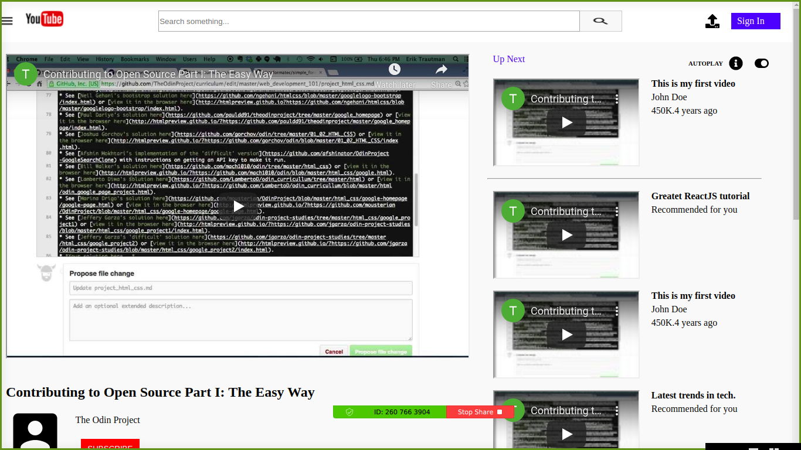

# Youtube Homepage

Youtube Hompage is a project that is based off creating a replica of the Youtube Video Player homepage. Below is a screenshot of ours.

It allows you to view a video and also gives you recommendation of other videos you'd like to watch. However, for now, this is just a static site.

## Built With

- HTML5
- CSS3

## Live Demo

[Live Demo Link](https://inspiring-noether-a0e4e5.netlify.app/)

## Getting Started

**This is an example of how you may give instructions on setting up your project locally.**
**Modify this file to match your project, remove sections that don't apply. For example: delete the testing section if the currect project doesn't require testing.**

To get a local copy up and running follow these simple example steps.

### Prerequisites
All you need is a working computer with a web browser on it.

### Setup
To setup the project:
1. Head over to github and clone the repository using `git clone https://github.com/KelynPNjeri/Youtube-Homepage.git` to your desired location.
2. Head over to the location and open the `Youtube-Homepage` folder.
3. Run `index.html` on your favorite browser.

## Authors

👤 **Kelyn Paul**

- Github: [@KelynPNjeri](https://github.com/KelynPNjeri)
- Twitter: [@kelynnjeri](https://twitter.com/kelynnjeri)
- Linkedin: [Kelyn Paul](https://linkedin.com/kelynpaul)

👤 **Author2**

- Github: [@githubhandle](https://github.com/githubhandle)
- Twitter: [@twitterhandle](https://twitter.com/twitterhandle)
- Linkedin: [linkedin](https://linkedin.com/linkedinhandle)

## 🤝 Contributing

Contributions, issues and feature requests are welcome!

Feel free to check the [issues page](issues/).

## Show your support

Give a ⭐️ if you like this project!

## 📝 License

This project is [MIT](lic.url) licensed.
